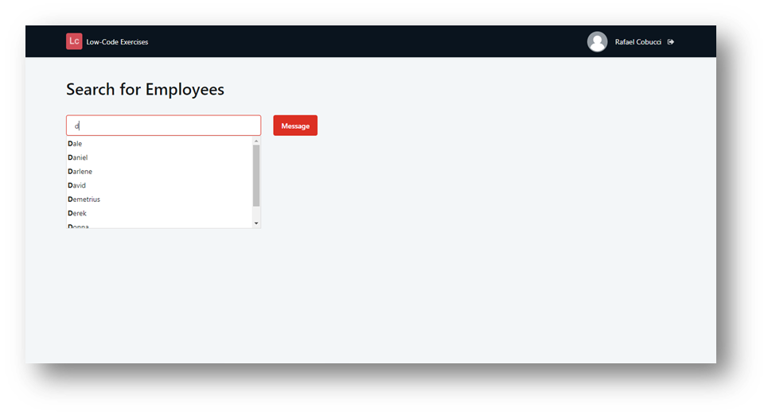

## :ledger: AutoCompleteSearch

### About The Exercise:

Create a search field with autocomplete.

### What you will practice:

Aggregate(filters), Input, RichWidgets (Input_AutoComplete, Feedback_Message)

### Useful links and resoucers:

- https://success.outsystems.com/Documentation/11/Developing_an_Application/Use_Data/Query_Data
- https://success.outsystems.com/Documentation/How-to_Guides/Front-End/How_to_create_a_search_field_with_autocomplete_in_a_Traditional_Web_App

### Example

