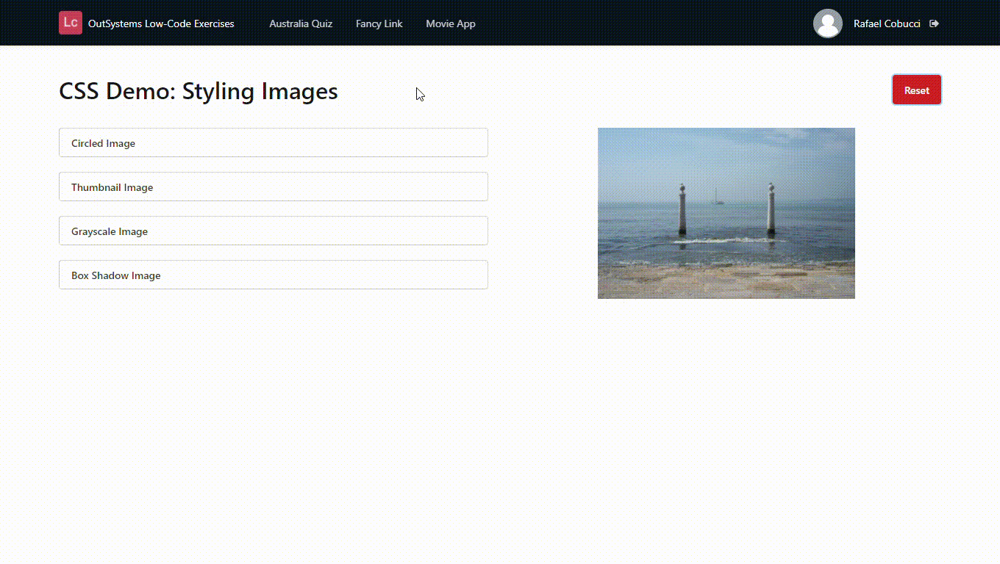

## :ledger: DynamicCSS

### About The Exercise:

Create CSS classes and apply to an image dynamically. 

### What you will practice:

Screen action, Local variable, Image widget, CSS properties, If built-in function, Ajax refresh.

### Useful links and resoucers:

- https://success.outsystems.com/Documentation/11/Developing_an_Application/Design_UI/Look_and_Feel/Cascading_Style_Sheets_(CSS)
- https://success.outsystems.com/Documentation/11/Developing_an_Application/Implement_Application_Logic/Actions_in_Web_Applications
- https://success.outsystems.com/Documentation/11/Reference/OutSystems_Language/Logic/Built-in_Functions/Miscellaneous
- https://www.w3schools.com/css/css3_images.asp

### Example

