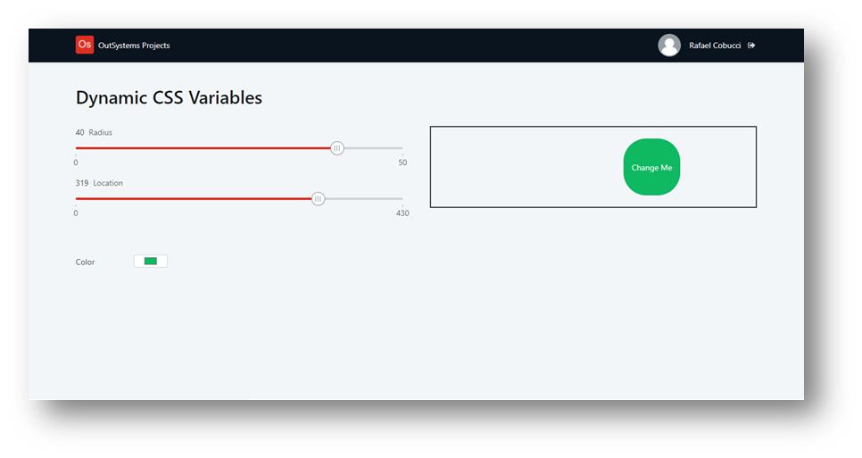

## :ledger: DynamicCSSVariables

### About The Exercise:

Dynamically change CSS variable settings using Controls/RangeSlider and Extended properties.

### What you will practice:

UI pattern - RangeSlider, Input - type: color, Container extended properties, CSS properties.

### Useful links and resoucers:

- https://success.outsystems.com/Documentation/11/Developing_an_Application/Design_UI/Patterns/Using_Traditional_Web_Patterns/Controls/Range_Slider
- https://developer.mozilla.org/en-US/docs/Web/CSS/transform
- https://developer.mozilla.org/en-US/docs/Web/HTML/Element/input
- https://developer.mozilla.org/en-US/docs/Web/HTML/Global_attributes/style

### Example

