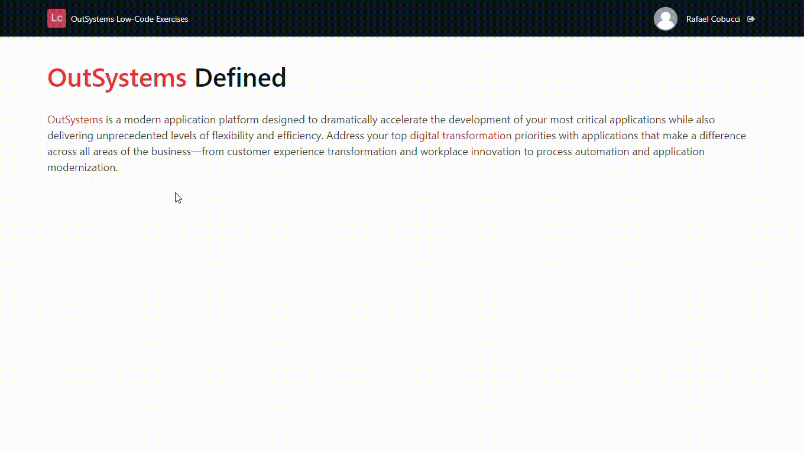

## :ledger: FancyLink

### About The Exercise:

Create a fancy animated link using CSS hover affects. 

### What you will practice:

Link widget, CSS style sheet editor, CSS selectors.

### Useful links and resoucers:

- https://success.outsystems.com/Documentation/11/Developing_an_Application/Design_UI/Look_and_Feel/Cascading_Style_Sheets_(CSS)
- https://developer.mozilla.org/en-US/docs/Web/CSS/:hover
- https://developer.mozilla.org/en-US/docs/Web/CSS/::after
- https://www.youtube.com/watch?v=ceNMP-aQkQ4 - Kevin Powell (YouTube channel)

### Example

