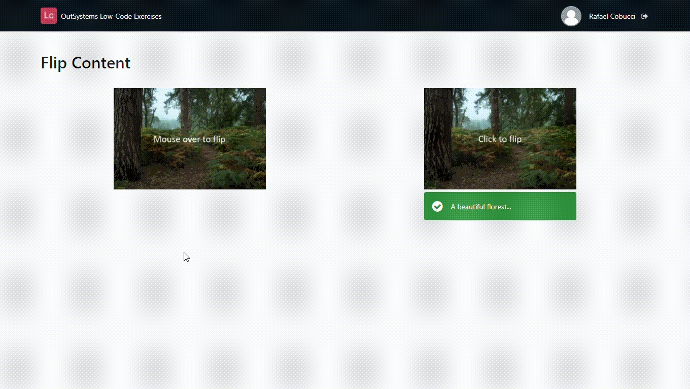

## :ledger: FlipContent

### About The Exercise:

Change the orientation (Vertical Flip) of images across two axes. On click change the status and the message of the Alert(UI pattern).

### What you will practice:

UI pattern - FlipContent and Alert, Screen action, Image widget, CSS selectors.

### Useful links and resoucers:

- https://success.outsystems.com/Documentation/11/Developing_an_Application/Design_UI/Patterns/Using_Traditional_Web_Patterns/Utilities/Flip_Content
- https://success.outsystems.com/Documentation/11/Reference/OutSystems_Language/Traditional_Web/Web_Interfaces/Patterns/Flip_Content_Reference
- https://success.outsystems.com/Documentation/11/Developing_an_Application/Design_UI/Patterns/Using_Traditional_Web_Patterns/Content/Alert
- https://developer.mozilla.org/en-US/docs/Web/CSS/transform-function/rotateX()

### Example

