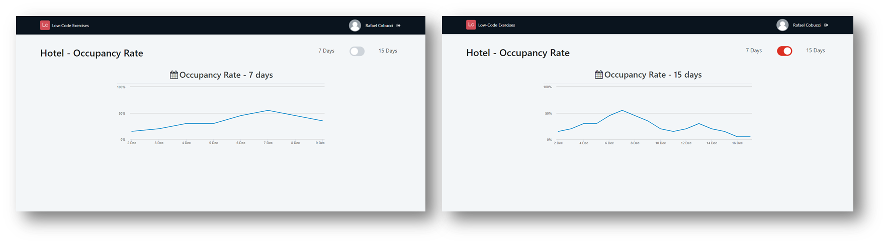
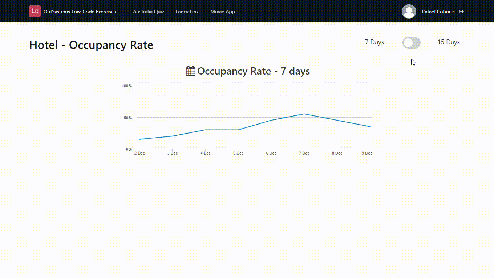

## :ledger: OccupancyRateChart

### About The Exercise:

Create a line chart using DataPoint (Charts structure). The Chart should display the hotel occupancy, in percentage (Y-axis), for the next 7 and 15 days (X-axis).

### What you will practice:

Chart widget, Chart properties, Built-in functions (AddDays, DiffDays), Aggregate - Filters, Local Variable, UI pattern- Toggle Button.

### Useful links and resoucers:

- https://success.outsystems.com/Documentation/11/Reference/OutSystems_APIs/Charts_API#Structure_DataPoint
- https://success.outsystems.com/Documentation/11/Reference/OutSystems_APIs/Charts_API/Create_Line_and_Area_Charts
- https://success.outsystems.com/Documentation/11/Developing_an_Application/Design_UI/Patterns/Using_Traditional_Web_Patterns/Controls/Toggle_Button

### Example

