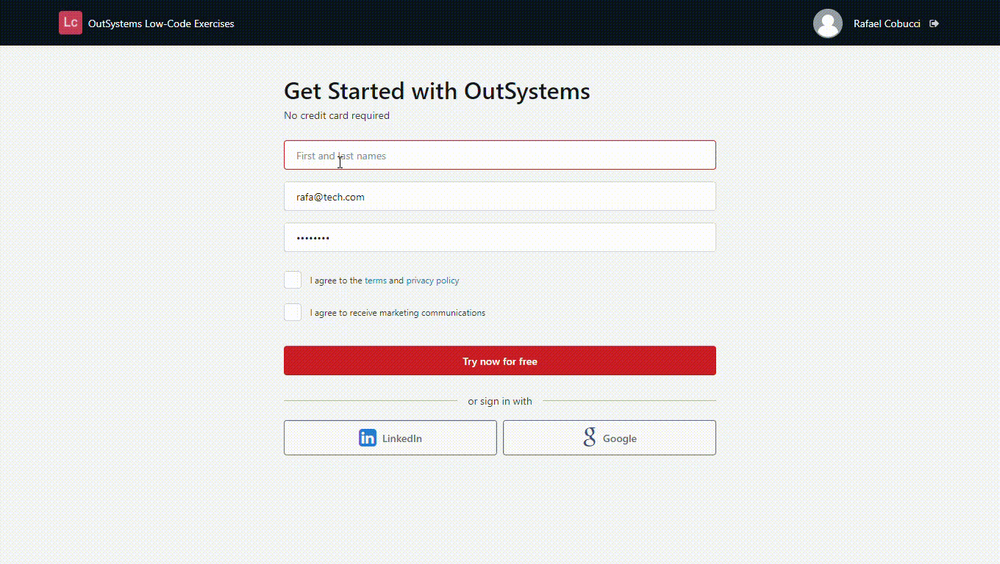

## :ledger: OutSystemsSignUp

### About The Exercise:

Clone the OutSystems signup page. 

### What you will practice:

Form validation, Email validation using Regex_Search(Server Action), On Change Event.

### Useful links and resoucers:

- https://www.outsystems.com/home/signup.aspx
- https://success.outsystems.com/Documentation/11/Developing_an_Application/Design_UI/Forms
- https://success.outsystems.com/Documentation/11/Reference/OutSystems_APIs/Text_API
- https://www.outsystems.com/forums/discussion/9324/input-on-change-is-too-fast/
- https://success.outsystems.com/Documentation/11/Developing_an_Application/Reuse_and_Refactor/Expose_and_Reuse_Functionality_Between_Modules

### Example

