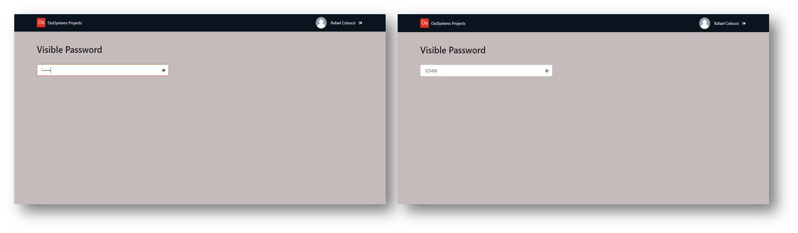

## :ledger: PasswordVisibility

### About The Exercise:

Create an input with the type of password and an icon that allows users to click it to toggle the visibility of the password.

### What you will practice:

Input - type: password; Local variable, If widget, Ajax refresh, InputWithIcon widget.

### Useful links and resoucers:

- https://success.outsystems.com/Documentation/11/Developing_an_Application/Design_UI/Patterns/Using_Traditional_Web_Patterns/Controls/Input_with_Icon
- https://developer.mozilla.org/en-US/docs/Web/HTML/Element/input/password

### Example

