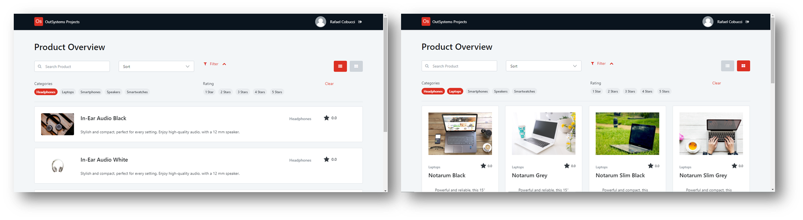

## :ledger: ProductCatalog

### About The Exercise:

Rebuild an Outsystems Reactive Screen Template (Product Catalog).  A product showcase on a single screen that can switch between a gallery and a list view.

### What you will practice:

UI patterns - (Gallery, Search, Tag), Switch widget, If function, Refresh data, Ajax refresh, Combo Box widget, Custom data type, Link, Icon.

### Useful links and resoucers:

- https://outsystemsui.outsystems.com/WebStyleGuidePreview/UIPatterns.aspx
- https://success.outsystems.com/Documentation/10/Reference/OutSystems_Language/Logic/Built-in_Functions/Miscellaneous
- https://success.outsystems.com/Documentation/11/Developing_an_Application/Use_Data/Use_Structures_and_Records_to_Create_Compound_Data_Types
- https://success.outsystems.com/Documentation/11/Reference/OutSystems_Language/Traditional_Web/Web_Logic_Tools/Switch

### Example

