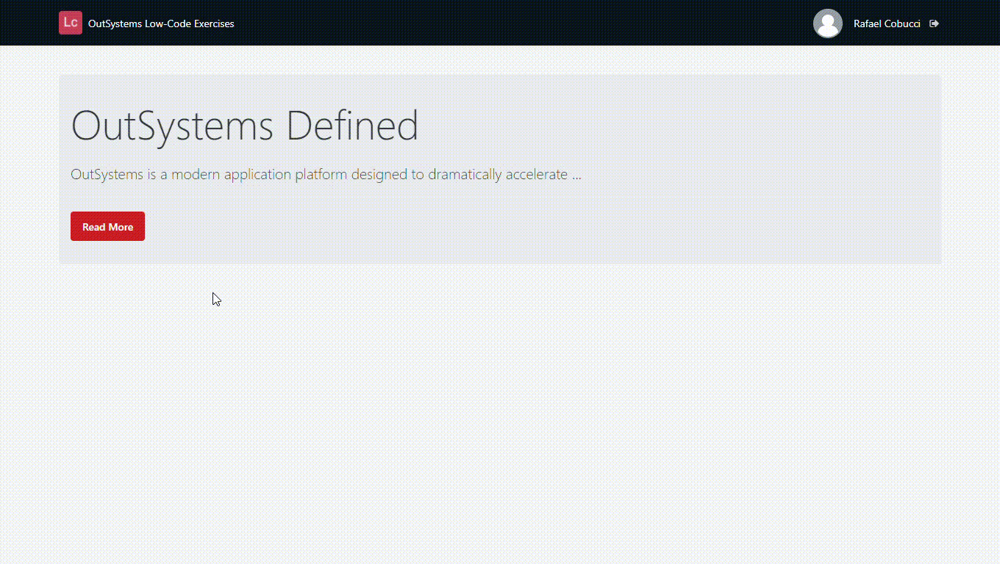

## :ledger: ReadMoreButton

### About The Exercise:

Show the hidden information by clicking on a Read more button.

### What you will practice:

Local variable - Data type: Boolean, Screen action, If widget, Ajax refresh, Expression, TextEllipsis (built-in function).

### Useful links and resoucers:

- https://success.outsystems.com/Documentation/11/Reference/OutSystems_Language/Data/Data_Types/Available_Data_Types
- https://www.outsystems.com/training/lesson/1928/demo-how-to-use-a-if-widget

### Example

