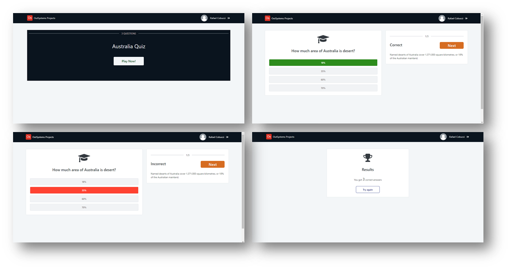

## :ledger: Australia Quiz Game

### About The Exercise:

Build a simple quiz game with a few questions about Australia. 

### What you will practice:

Local variable, List records, Ajax refresh, Card sectioned, Expression, Icons, If function, CSS classes.

### Useful links and resoucers:

- https://www.youtube.com/watch?v=J8QbjXdVl9c
- https://success.outsystems.com/Documentation/11/Developing_an_Application/Use_Data/Bootstrap_an_Entity_Using_an_Excel_File
- https://success.outsystems.com/Documentation/11/Reference/OutSystems_Language/Traditional_Web/Web_Interfaces/Designing_Screens/List_Records_Widget
- https://success.outsystems.com/Documentation/11/Developing_an_Application/Design_UI/Look_and_Feel/Cascading_Style_Sheets_(CSS)
- https://success.outsystems.com/Documentation/11/Reference/OutSystems_Language/Traditional_Web/Web_Logic_Tools/Ajax_Refresh

### Example

