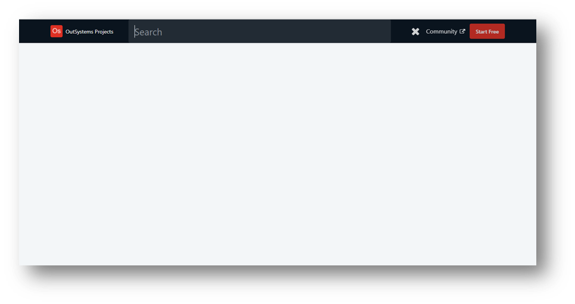

## :ledger: FloatingSearchBar

### About The Exercise:

Create a floating search bar. Clone the floating search bar from OutSystems Official Website.

### What you will practice:

Web Block, Link, Icons, built-in action (RunJavaScript), CSS properties. 

### Useful links and resoucers:

- https://success.outsystems.com/Documentation/11/Extensibility_and_Integration/JavaScript/Extend_Your_Web_Application_Using_JavaScript/Define_and_Run_JavaScript_Code
- https://success.outsystems.com/Documentation/11/Developing_an_Application/Design_UI/Look_and_Feel/Cascading_Style_Sheets_(CSS)
- https://success.outsystems.com/Documentation/11/Developing_an_Application/Design_UI/Reuse_UI/Create_and_Reuse_Screen_Blocks
- https://developer.cdn.mozilla.net/pt-BR/docs/Web/API/Element/classList
- https://developer.mozilla.org/en-US/docs/Web/CSS/position
- https://developer.mozilla.org/en-US/docs/Web/CSS/CSS_Transitions/Using_CSS_transitions
- https://developer.mozilla.org/en-US/docs/Web/CSS/transform

### Example

