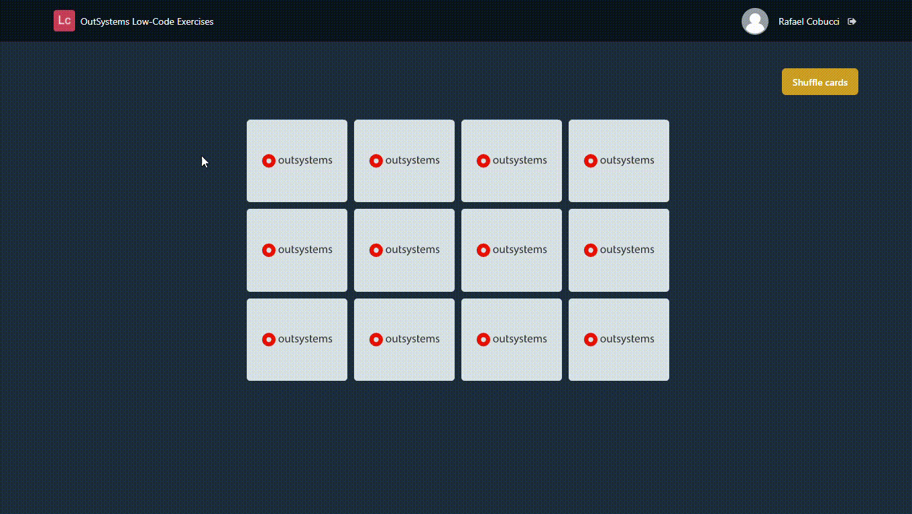

## :ledger: MemoryCardGame

### About The Exercise:

Build a matching card game. 

### What you will practice:

Built-in action (RunJavaScript), If widget, CSS properties, Screen Action - Input parameter, Image widget.

### Useful links and resoucers:

- https://www.youtube.com/watch?v=ZniVgo8U7ek - freeCodeCamp.org
- https://success.outsystems.com/Documentation/11/Extensibility_and_Integration/JavaScript/Extend_Your_Web_Application_Using_JavaScript/Define_and_Run_JavaScript_Code
- https://developer.cdn.mozilla.net/pt-BR/docs/Web/API/Element/classList
- https://www.w3schools.com/howto/howto_css_flip_card.asp

### Example

