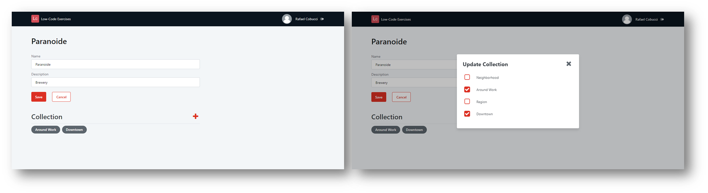

## :ledger: ModalDialog

### About The Exercise:

Data modelling a many-to-many relationship and build an application to tag tourist attractions in your city.

### What you will practice:

Create a Many-to-Many Relationship, Web block, Modal, Tag.

### Useful links and resoucers:

- https://jacques.io/2020-09-01_outsystems-pattern_tag-dialog-with-outsystems/
- https://success.outsystems.com/Documentation/11/Developing_an_Application/Use_Data/Data_Modeling/Entity_Relationships/Create_a_Many-to-Many_Relationship
- https://success.outsystems.com/Documentation/11/Developing_an_Application/Use_Data/Query_Data
- https://success.outsystems.com/Documentation/11/Developing_an_Application/Design_UI/Patterns/Using_Traditional_Web_Patterns/Content/Modal
- https://success.outsystems.com/Documentation/11/Developing_an_Application/Design_UI/Patterns/Using_Traditional_Web_Patterns/Content/Tag
- https://www.youtube.com/watch?v=qpgiIZS5etY - OutSystems YouTube Channel

### Example

