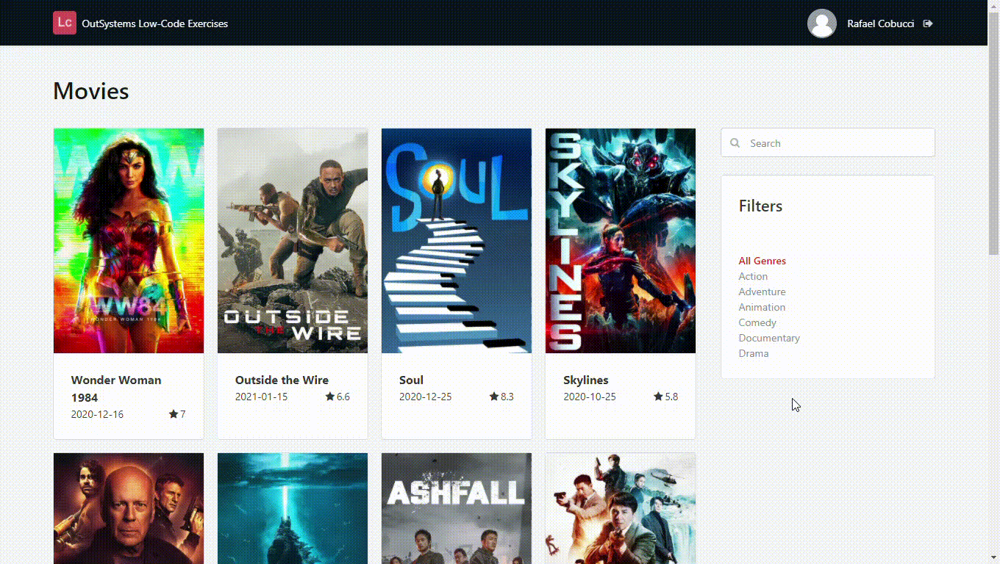

## :ledger: MovieApp

### About The Exercise:

Build an application to search for movies. 

### What you will practice:

How to consume REST API, Web Screen Templates, ListAppend, ListClear, ForEach widget, Ajax refresh, custom data type.

### Useful links and resoucers:

- https://www.themoviedb.org/documentation/api
- https://success.outsystems.com/Documentation/11/Extensibility_and_Integration/REST/Consume_REST_APIs/Consume_One_or_More_REST_API_Methods
- https://success.outsystems.com/Documentation/11/Developing_an_Application/Use_Data/Use_Structures_and_Records_to_Create_Compound_Data_Types
- https://success.outsystems.com/Documentation/11/Extensibility_and_Integration/REST/Consume_REST_APIs/Handling_REST_Errors

### Example

