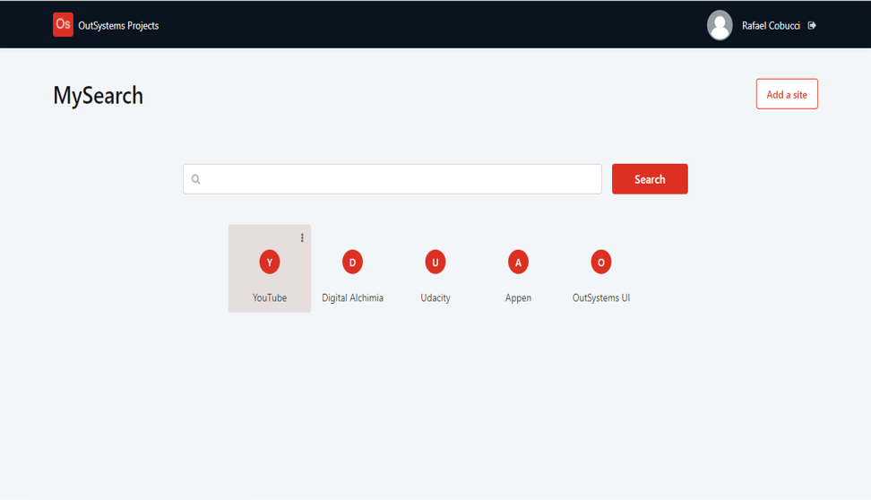

## :ledger: MySearch

### About The Exercise:

Create your own search engine page. 

### What you will practice:

Aggregate, CRUD operations, External URL, Modal, Balloon, Section, CSS Pseudo-classes.

### Useful links and resoucers:

- https://outsystemsui.outsystems.com/WebStyleGuidePreview/Homepage.aspx
- https://success.outsystems.com/Documentation/11/Developing_an_Application/Design_UI/Patterns/Using_Traditional_Web_Patterns/Content/Modal
- https://success.outsystems.com/Documentation/11/Developing_an_Application/Design_UI/Patterns/Using_Web_Patterns/Content/Balloon
- https://success.outsystems.com/Documentation/11/Developing_an_Application/Design_UI/Look_and_Feel/Cascading_Style_Sheets_(CSS)
- https://developer.mozilla.org/en-US/docs/Web/CSS/Pseudo-classes
- https://developer.mozilla.org/en-US/docs/Web/API/Event/stopPropagation

### Example

