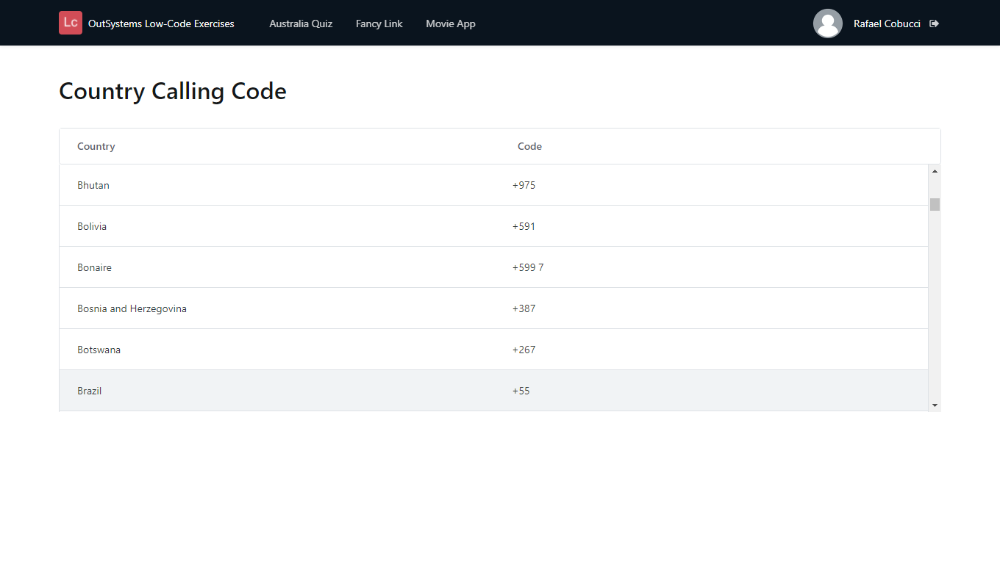

## :ledger: WebScraping

### About The Exercise:

Extract data from a website that provides country calling codes. Use a Table records to displays the data. 

### What you will practice:

Extracting data from websites, How to integrate a Forge component, How to consume REST API, Table records.

### Useful links and resoucers:

- https://www.outsystems.com/blog/posts/web-scraping-tutorial/
- https://success.outsystems.com/Documentation/10/Getting_Started/Use_a_Forge_Component_Made_by_the_Community?origin=d
- https://success.outsystems.com/Documentation/11/Extensibility_and_Integration/REST/Consume_REST_APIs/Consume_One_or_More_REST_API_Methods
- https://success.outsystems.com/Documentation/How-to_Guides/Front-End/How_to_scroll_records_in_a_table_with_a_fixed_header
- https://en.wikipedia.org/wiki/Web_scraping#:~:text=Web%20scraping%2C%20web%20harvesting%2C%20or,or%20through%20a%20web%20browser.
- https://en.wikipedia.org/wiki/List_of_country_calling_codes

### Example

