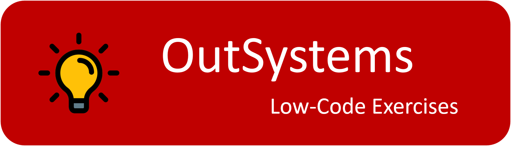

## :ledger: OutSystems Low-Code Exercises

No idea what to do to practice Outsystems? Here are a list of low-code exercises that will help you improving your OutSystems skills!! 👍

These exercises are focuses on:

- UI Development;
- Logic;
- Data Modeling;
- Web Services Integration;
- Service Studio 11;
- Traditional Web Apps

## Exercises

Exercises are divided into two levels.

| Level |                                                                                    |
|  :-:  | -----------------------------------------------------------------------------------|
|   1   | Beginner - Focused on UI patterns and widgets.                                     |
|   2   | Intermediate - API services and a little bit more of logic                         |

### Level-1: Beginner Exercises

| Name                                                                              | Short Description                                                  | Level      |
| --------------------------------------------------------------------------------- | -------------------------------------------------------------------|------------|
| [AutoCompleteSearch](./Projects/1-Beginner/AutoCompleteSearch.md)                 | Create a search field with autocomplete                            | 1-Beginner |
| [DynamicCSSVariables](./Projects/1-Beginner/DynamicCSSVariables.md)               | Dynamically change CSS variable settings                           | 1-Beginner |
| [FlipContent](./Projects/1-Beginner/FlipContent.md)                               | Set up a flip content with two images                              | 1-Beginner |
| [HighChart](./Projects/1-Beginner/HighChart.md)                                   | Chart showing a combination of a column and a line chart           | 1-Beginner |
| [OccupancyRateChart](./Projects/1-Beginner/OccupancyRateChart.md)                 | Create a chart using DataPoint structure                           | 1-Beginner |
| [OutSystemsSignUp](./Projects/1-Beginner/OutSystemsSignUp.md)                     | Clone Outsystems signup page                                       | 1-Beginner |
| [PasswordVisibility](./Projects/1-Beginner/PasswordVisibility.md)                 | Toggle Password Visibility                                         | 1-Beginner |
| [ProductCatalog](./Projects/1-Beginner/ProductCatalog.md)                         | Rebuild an Outsystems Screen Template                              | 1-Beginner |
| [ReCaptcha](./Projects/1-Beginner/ReCaptcha.md)                                   | Consume a Forge component                                          | 1-Beginner |
| [Simple Checkout Page](./Projects/1-Beginner/SimpleCheckoutPage.md)               | Create a simple checkout page                                      | 1-Beginner |

### Level-2: Intermediate Exercises

| Name                                                                              | Short Description                                                  | Level          |
| --------------------------------------------------------------------------------- | -------------------------------------------------------------------|----------------|
| [Australia Quiz Game](./Projects/2-Intermediate/AustraliaQuizGame.md)             | Build a simple quiz game                                           | 2-Intermediate |
| [CatApp](./Projects/2-Intermediate/CatApp.md)                                     | Learn about the characteristics and behaviors of your cat's breed  | 2-Intermediate |
| [FloatingSearchBar](./Projects/2-Intermediate/FloatingSearchBar.md)               | Create a floating search bar                                       | 2-Intermediate |
| [MemoryCardGame](./Projects/2-Intermediate/MemoryCardGame.md)                     | The object of the game is to turn over pairs of matching cards     | 2-Intermediate |
| [ModalDialog](./Projects/2-Intermediate/ModalDialog.md)                           | Manage many-to-many relationship                                   | 2-Intermediate |
| [MovieApp](./Projects/2-Intermediate/MovieApp.md)                                 | Browse your next movie to watch                                    | 2-Intermediate |
| [MySearchPage](./Projects/2-Intermediate/MySearch.md)                             | Your own search engine page                                        | 2-Intermediate |
| [RockPaperScissors](./Projects/2-Intermediate/RockPaperScissors.md)               | The classic rock paper scissor game                                | 2-Intermediate |
| [WeatherApp](./Projects/2-Intermediate/WeatherApp.md)                             | Get the weather condition of a city                                | 2-Intermediate |
| [WebScraping](./Projects/2-Intermediate/WebScraping.md)                           | Extract data from a website                                        | 2-Intermediate |

### Thanks for inspiration: 👍

- Florin Pop        -- https://github.com/florinpop17
- Colt Steele       -- https://github.com/Colt
- Beatriz Silva     -- https://www.outsystems.com/profile/233465/
- Rafa OutSystems   -- https://www.linkedin.com/in/rafa-outsystems/
