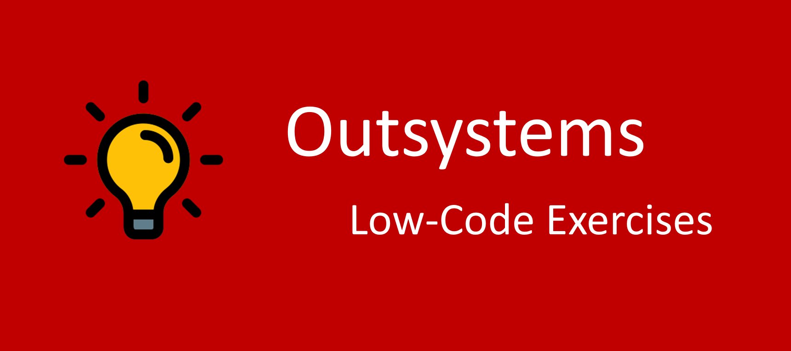

# OutsystemsProjects
A list of low-code exercises
## :ledger: OutSystems Low-Code Exercises

[

No idea what to do to practice Outsystems Low-Code? Here are a list of exercises that will help you improving your coding skills!! 👍

These exercises are focuses on:

- UI development;
- logic;
- data modeling;
- web services integration;

## Exercises

Exercises are divided into two tiers.

| Tier | Level                                                                              |
| :--: | -----------------------------------------------------------------------------------|
|  1   | Beginner - Those who are typically focused on creating user-facing applications.   |
|  2   | Intermediate - Building apps that use API services.                                |

### Tier-1: Beginner Exercises

| Name                                                                              | Short Description                                                  | Tier       |
| --------------------------------------------------------------------------------- | -------------------------------------------------------------------|------------|
| [Australia Quiz Game](./Projects/1-Beginner/AustraliaQuiz.md)                     | Build a simple quiz game                                           | 1-Beginner |
| [AutoCompleteSearch](./Projects/1-Beginner/AutoCompleteSearch.md)                 | Create a search field with autocomplete                            | 1-Beginner |
| [DynamicCSSVariables](./Projects/1-Beginner/DynamicCSSVariables.md)               | Dynamically change CSS variable settings                           | 1-Beginner |
| [FlipContent](./Projects/1-Beginner/Christmas-Lights-App.md)                      | Set up a flip content with two images                              | 1-Beginner |
| [FloatingSearchBar](./Projects/1-Beginner/FloatingSearchBar.md)                   | Create a floating search bar                                       | 1-Beginner |
| [HighChart](./Projects/1-Beginner/HighChart.md)                                   | Chart showing a combination of a column and a line chart           | 1-Beginner |
| [MemoryCardGame](./Projects/1-Beginner/MemoryCardGame.md)                         | A card memory game                                                 | 1-Beginner |
| [ModalDialog](./Projects/1-Beginner/ModalDialog.md)                               | Manage many-to-many relationship                                   | 1-Beginner |
| [MySearch Page](./Projects/1-Beginner/MySearch.md)                                | A search engine page                                               | 1-Beginner |
| [OccupationRateChart](./Projects/1-Beginner/OccupationRateChart.md)               | Create a chart using DataPoint structure                           | 1-Beginner |
| [OutSystemsSignUp](./Projects/1-Beginner/OutSystemsSignUp.md)                     | Clone Outsystems signup page                                       | 1-Beginner |
| [PasswordVisibility](./Projects/1-Beginner/PasswordVisibility.md)                 | Toggle Password Visibility                                         | 1-Beginner |
| [ProductCatalog](./Projects/1-Beginner/ProductCatalog.md)                         | Rebuild an Outsystems Screen Template                              | 1-Beginner |
| [ReCaptcha](./Projects/1-Beginner/ReCaptcha.md)                                   | ReCaptcha Forge component                                          | 1-Beginner |
| [RockPaperScissors](./Projects/1-Beginner/RockPaperScissors.md)                   | A simple rock paper scissor game                                   | 1-Beginner |
| [Simple Checkout Page](./Projects/1-Beginner/CheckoutPage.md)                     | Create a simple checkout page                                      | 1-Beginner |
| [TableWithFixedHeader](./Projects/1-Beginner/TableWithFixedHeader.md)             | A scrollable table with a fixed header                             | 1-Beginner |
| [WebBlockPassData](./Projects/1-Beginner/WebBlockPassData.md)                     | Get values from web block                                          | 1-Beginner |

### Tier-2: Intermediate Exercises

| Name                                                                              | Short Description                                                  | Tier           |
| --------------------------------------------------------------------------------- | -------------------------------------------------------------------|----------------|
| [CatApp](./Projects/1-Beginner/CatApp.md)                                         | Discover more about cat breeds                                     | 2-Intermediate |
| [MovieApp](./Projects/1-Beginner/MovieApp.md)                                     | Browse your next movie to watch                                    | 2-Intermediate |
| [WeatherApp](./Projects/1-Beginner/WeatherApp.md)                                 | Get the weather condition of a city                                | 2-Intermediate |
| [WebScraping](./Projects/1-Beginner/WebScraping.md)                               | Extract data from a website                                        | 2-Intermediate |
